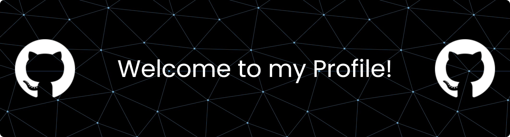

  

<h1 align="center">Hi 👋, I'm Vasu Goel</h1>
<h3 align="center">🤖 Software Developer specializing in AI/ML</h3>

  

  <i>Engineering intelligence with math, models, and code!</i>

## 💫 About Me:
🔭 I’m currently working on building scalable AI-powered applications 
👯 I’m looking to collaborate on Open Source contributions and innovative projects  
🤝 I’m looking for help with improving system design and exploring advanced technologies 
🌱 Committed to continuous learning and innovation 
💬 Ask me about AI, Machine Learning, and problem-solving 
⚡ Fun fact: If there’s a pattern, there’s a program

---

## 🛠️ Tech Stack & Tools

<h3 align="center">💻 Programming Languages</h3>

  <kbd></kbd> &nbsp;
  <kbd></kbd> &nbsp;
  <kbd></kbd> &nbsp;
  <kbd></kbd>

Python • C++ • C • MySQL

<h3 align="center">🧠 Machine Learning & Deep Learning</h3>

  <kbd></kbd> &nbsp;
  <kbd></kbd> &nbsp;
  <kbd></kbd> &nbsp;
  <kbd></kbd>

TensorFlow • PyTorch • Scikit-Learn • OpenCV

<h3 align="center">🤖 Generative AI</h3>

  <kbd></kbd> &nbsp;
  <kbd></kbd> &nbsp;
  <kbd></kbd> &nbsp;
  <kbd></kbd>

LangChain • LangGraph • Gemini API • Vector Databases

<h3 align="center">📊 Data Processing & Visualization</h3>

  <kbd></kbd> &nbsp;
  <kbd></kbd> &nbsp;
  <kbd></kbd> &nbsp;
  <kbd></kbd>

Pandas • NumPy • Matplotlib • Seaborn

<h3 align="center">⚙️ Backend</h3>

  <kbd></kbd> &nbsp;
  <kbd></kbd> &nbsp;
  <kbd></kbd>

FastAPI • Flask • MongoDB

<h3 align="center">☁️ DevOps & Tools</h3>

  <kbd></kbd> &nbsp;
  <kbd></kbd> &nbsp;
  <kbd></kbd> &nbsp;
  <kbd></kbd> &nbsp;
  <kbd></kbd>

  <kbd></kbd> &nbsp;
  <kbd></kbd> &nbsp;
  <kbd></kbd> &nbsp;
  <kbd></kbd>

Docker • AWS • Git • GitHub • Postman • VS Code • Jupyter • Linux • Windows

---

## 📊 GitHub Stats

  

---

## 📫 Connect with Me  

  
  &nbsp;&nbsp;
  
  &nbsp;&nbsp;
  

  

